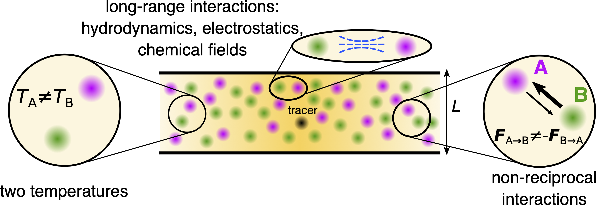

## Nonequilibrium mixtures and active droplets

Our research investigates the physics of **active soft matter systems** and **biomolecular condensates,** with a strong focus on understanding **diffusion and transport** phenomena in complex, nonequilibrium environments. 

A significant part of my work explores the diffusion of tracer particles within dense mixtures of soft particles, often connected to different thermostats, revealing how activity and crowding affect tracer mobility and challenge classical diffusion theories. I develop analytical frameworks based on linearized density field theories and path-integral methods that accurately describe tracer diffusion in these heterogeneous and active media. My results also highlight the impact of nonreciprocal interactions on diffusion enhancement and the breakdown of traditional relations like the Einstein relation.

Additionnallt, using a combination of microscopic stochastic simulations and analytical approaches, I study how enzymatic reactions and molecular interactions govern the formation, stability, and dynamics of chemically active droplets and biomolecular condensates, which play crucial roles in cellular organization.  Additionally, I investigate how chemically active droplets modulate molecular encounter kinetics, showing that condensates can both accelerate and hinder biochemical reactions depending on the interplay of reaction-driven fluxes and transport limitations. These findings deepen our understanding of transport processes in biologically relevant crowded and active environments, connecting microscopic interactions to emergent nonequilibrium behaviors.

## Propulsion of isotropic active particles

## Chemotaxis and synchronization of enzyme molecules

